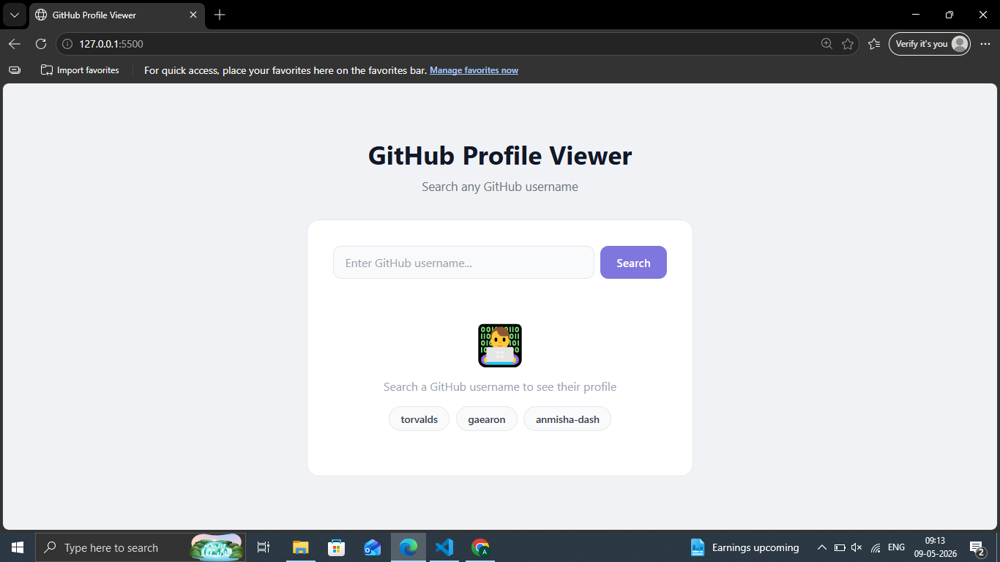

# Day 19 — GitHub Profile Viewer

Search any GitHub username and see their profile, stats and top repos.

## Preview

## Features
- Search any GitHub username
- Shows avatar, name, bio, location
- Stats — repos, followers, following, gists
- Top 5 repos sorted by stars
- Each repo shows stars, forks and language
- Quick search buttons for popular users
- Direct link to GitHub profile
- No API key needed

## Tech Stack
- HTML5
- CSS3 (Grid, Flexbox, transitions)
- JavaScript (fetch, Promise.all, async/await)

## API Used
- [GitHub REST API](https://api.github.com) — free, no key needed

## What I Learned
- Using Promise.all to fetch two APIs simultaneously
- Displaying API image data with img src
- Handling 404 API errors gracefully
- Formatting large numbers (1000 → 1k)

## Part of
[30 Days 30 Projects](https://github.com/anmisha-dash/30-days-30-projects) challenge